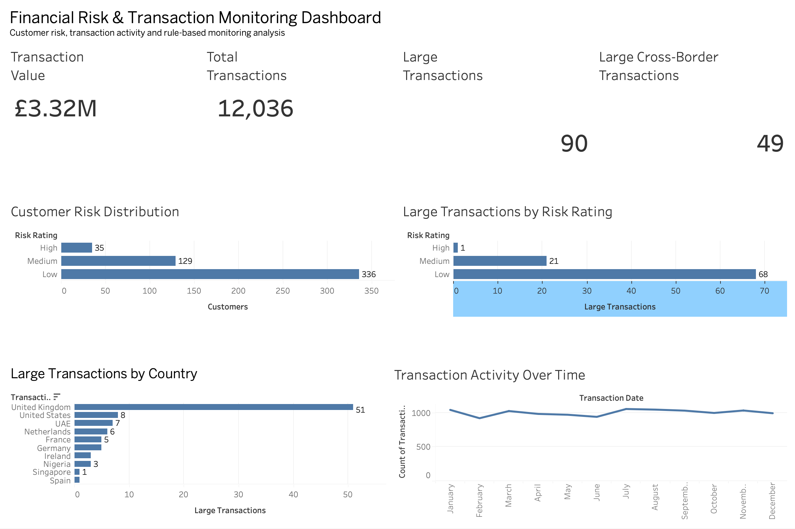

# Financial Risk & Transaction Monitoring Analysis

This is a portfolio project where I used SQL and Tableau to look at customer risk and transaction activity.

The aim was to practise working with multiple datasets, joining tables and using simple rules to identify transactions that may need further review.

## Tools Used

- PostgreSQL
- DBeaver
- SQL
- Tableau Public

## Dataset

The project uses synthetic customer, account and transaction data.

The data is split into three tables:

- `customers` - customer details, country and risk rating
- `accounts` - customer account information
- `transactions` - transaction amounts, dates, countries and channels

The dataset contains 500 customers and 12,036 transactions.

## What I Looked At

I used SQL to explore:

- Customer risk ratings
- High-risk customers by country
- Customer and account information
- Overall transaction activity
- Large transactions
- Customers making repeated large transactions
- Cross-border transactions

For this project, I used £7,000 as the threshold for a large transaction. This was only a rule used for the project and is not a regulatory threshold.

## Some Findings

- There were 12,036 transactions with a total value of about £3.32 million.
- 90 transactions were £7,000 or more.
- 49 of the large transactions were cross-border.
- 8 customers made more than one large transaction.
- There were 336 Low-risk, 129 Medium-risk and 35 High-risk customers.
- Of the 90 large transactions, 68 came from Low-risk customers, 21 from Medium-risk customers and 1 from a High-risk customer.

One thing I found interesting was that most of the large transactions came from customers rated as Low risk. This showed me that looking at transaction activity as well as the customer's risk rating can give a better view of the data.

## Dashboard

I created a Tableau dashboard to show the main results from the analysis.

### View Interactive Dashboard

[View the dashboard on Tableau Public](https://public.tableau.com/views/FinancialRiskTransactionMonitoringAnalysis/Dashboard1?:language=en-US&:sid=&:redirect=auth&:display_count=n&:origin=viz_share_link)

## SQL

The SQL queries used for the analysis can be found in the [`sql`](sql/) folder.

The project helped me practise using:

- SELECT statements
- WHERE filters
- JOINs
- GROUP BY
- COUNT, SUM and AVG
- HAVING
- ORDER BY

## Project Files

- `data/` - the datasets used for the project
- `sql/` - SQL analysis
- `images/` - dashboard image

## Note

This project uses synthetic data and was created for learning and portfolio purposes. I used £7,000 as the threshold for large transactions just for this project. It is not an official regulatory threshold.
